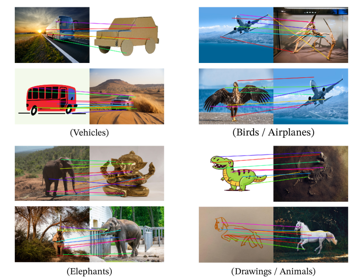
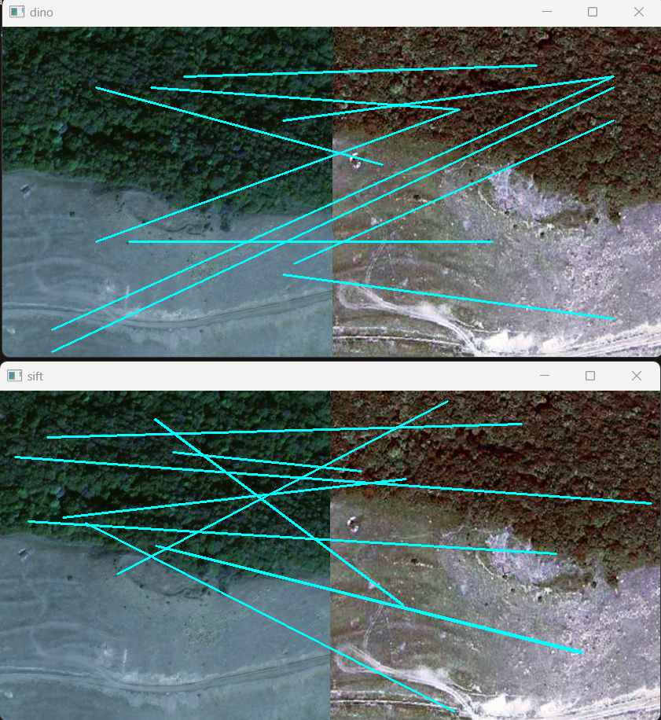
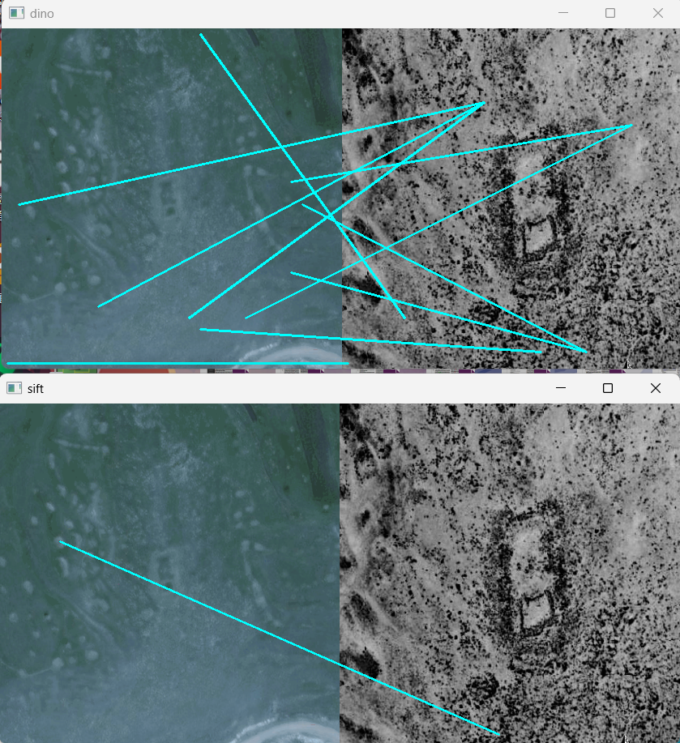

# A Semi-supervised Archaeological Site Detection Model based on Transfer Learning  
## This part of code is about the application of large pre-trained vision model [DINOv2](https://github.com/facebookresearch/dino) from MetaAI for feature points matching and training an AutoEncoder. We use the DINOv2 as a feature extractor, to see whether it can achieve the Matching performance mentioned by the [original paper](https://arxiv.org/abs/2304.07193). A ViT AutoEncoder is also appended in code.  
   
### Feature Matching  
We used the cosine similarity of feature tokens between 2 images to do the match procedure, and compared with the SIFT algorithm. Here is an example:  
   
    
As we can see, it could be further improved in feature points matching. And when the two images are different in style, comparison is ineligible for both SIFT and deep learning algorithms, we require a model which could perfectly extract the semantic information.  

### AutoEncoder  
The model is in the "models" folder, including a decoder and an autoencoder. And the training codes are in the autoencoder_main_py. The recovery performance can be seen as below:  
  

### Running  
If you want to reproduce the result, you may need a torch2.0 with gpu, and a gpu which has more than 6G memory. Please refer to the config.py to do the modification to fit your environment, and modify the dataloader to fit your datasets.  
