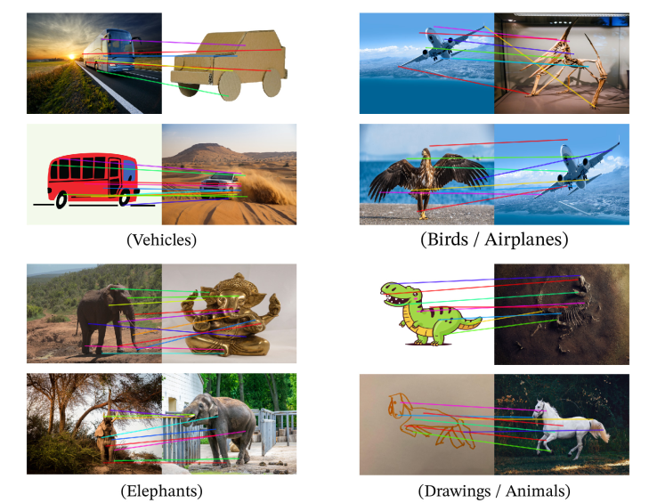
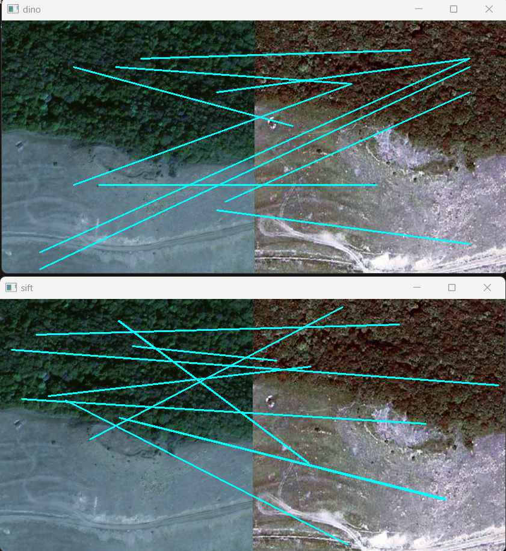
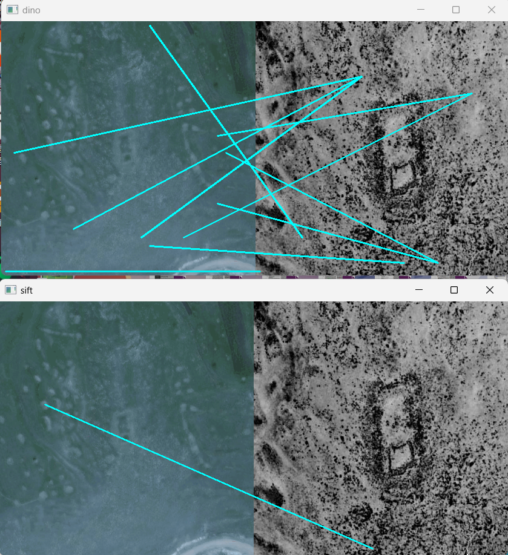

# A Semi-supervised Archaeological Site Detection Model based on Transfer Learning
## This part of code is about the application of large pre-trained vision model [DINOv2](https://github.com/facebookresearch/dino) from MetaAI for feature points matching. We use it as an extractor to see whether it can achieve the Matching performance mentoned by the [original paper](https://arxiv.org/abs/2304.07193). A ViT decoder is also appended in code.

We used the consine similarity between feature tokens between 2 images to do the match procedure, and compared with the SIFT algorithm. Here is an example:

As we can see, it could be further improved in feature points matching. And when the two images are different in style, comperation is ineligible for both SIFT and deep learning algorithms.
If you want to reproduce the result, you may need a torch2.0 with gpu, which has more than 6G memory. Please refer to the config.py to do the modification to fit your data.

In addition, a ViT decoder is also coded in the models folder, which can be further used to train a Auto Encoder.